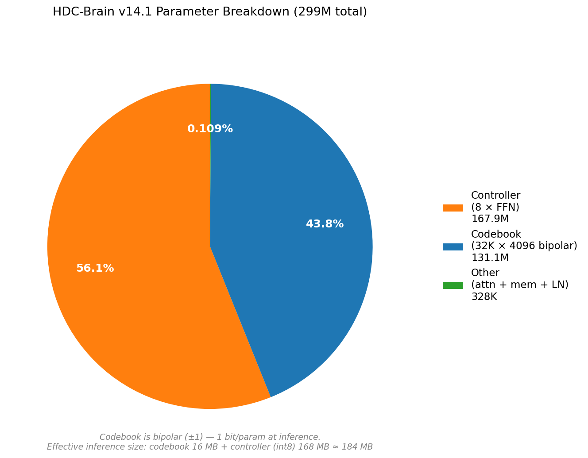
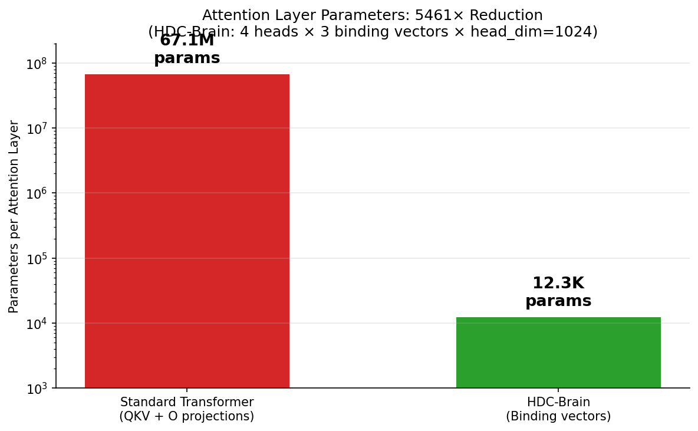
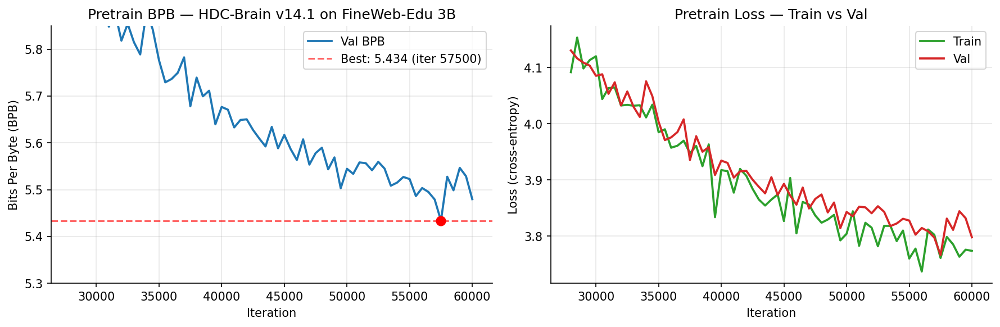
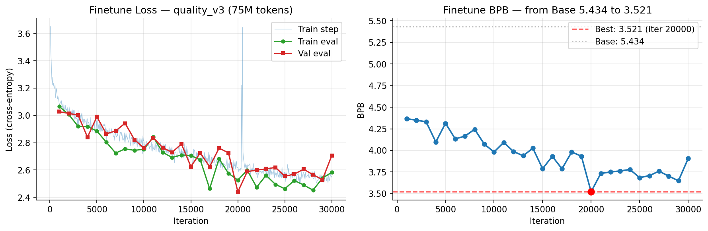

# HDC-Brain: A 300M Hyperdimensional Language Model with Bipolar Codebook

**Oleg Hasjanov**
*Independent Researcher, Tallinn, Estonia*
*oleg.phenomenon@gmail.com*

---

## Abstract

This paper presents **HDC-Brain v14.1**, a 299M parameter language model built on hyperdimensional computing (HDC) principles as an alternative to the standard transformer architecture. The model replaces learned embeddings with a **bipolar (±1) codebook** trained via straight-through estimator (STE), and replaces the quadratic-parameter QKV projections with **multi-head binding attention** using only 12,288 parameters per layer — a 5461× reduction over an equivalent-width transformer. Additional components include **thought loops** (iterative multi-pass reasoning through shared blocks) and a **parallel-scan HDC memory** with learned mass/decay (constant-memory alternative to KV-cache).

The model was pretrained on 3B tokens of FineWeb-Edu for 88 hours on a single RTX 3090, reaching a validation loss of **5.434 bits per BPE token** (equivalently **1.25 bits per raw byte** under our 32K tokenizer — 0.44 bits/byte behind SmolLM-360M and 0.13 bits/byte ahead of GPT-2-medium on the same FineWeb-Edu slice). After instruction finetuning on 591K filtered prompt-response pairs (75M tokens) drawn from OpenHermes 2.5, TULU-3, Alpaca-GPT4, Alpaca (×3), Dolly-15K, and WizardLM Evol-Instruct, the model reaches **3.521 bits per token** on held-out instruction-format text and produces coherent responses in the instruction-following format — correctly answering simple factual prompts (e.g. "Paris" as the capital of France) while exhibiting typical small-model failure modes on arbitrary factoids, arithmetic, and code generation. The bipolar codebook enables **16 MB** inference *storage* for a 32K vocabulary (versus 512 MB float32). Realising a corresponding *compute* advantage requires custom XNOR/POPCNT kernels, which are not implemented here; end-to-end latency measurements and binary-kernel inference are left as future work.

---

## 1. Introduction

Transformer-based language models have become the de-facto standard for natural language processing, but their deployment on resource-constrained devices remains challenging. A 1B parameter transformer requires ~4 GB of memory in float32 and relies on float matrix multiplication. Architectures whose weights are natively binary could, in principle, require far less memory and run on integer-only hardware (XNOR + POPCNT); realising the compute advantage in practice, however, requires binary kernels tuned for the target device, which are not part of this work.

**Hyperdimensional Computing (HDC)** [Kanerva, 2009] offers a natural fit: in HDC, information is represented by very high-dimensional vectors (typically thousands of dimensions) whose components are binary (±1). Similarity is cosine similarity, binding is element-wise multiplication (XNOR for bipolar), and bundling is summation. HDC has been successfully applied to classification and reasoning tasks, but — to the author's knowledge — has not been extended to full generative language modeling at scale.

This work bridges HDC and language modeling. The contributions are:

1. **STE Bipolar Codebook** — token embeddings are sign-constrained ±1 vectors, trained in float32 and binarized at forward pass via a straight-through estimator. This yields 1 bit per parameter at inference.
2. **Multi-Head Binding Attention** — instead of the three learned QKV projections (3D² parameters per layer), 3 learned binding vectors per head are applied via element-wise multiply. This reduces attention parameters from 67M to 12K at hidden size 4096.
3. **Thought Loops** — a learned multi-pass mechanism where the same block stack is applied K times with per-pass gating. Empirically, K=3 gives lowest validation loss and K=1 loses roughly 0.3 bits/token (Table 1 in §3.4); iterative refinement through shared weights is a meaningful source of effective depth under the reduced per-layer capacity of HDC-native operations.
4. **HDC Memory** — a parallel-scan recurrence with learned per-token mass (importance) and decay (forgetting), replacing KV-cache with O(D) memory regardless of sequence length.

This architecture is pretrained from scratch on 3B tokens and instruction-finetuned into a model that reliably follows the instruction–response template (with factual recall limited to heavily-represented prompts, documented in §5.1). The resulting 299M-parameter model fits into approximately 184 MB of memory at inference (codebook binary + controller int8).

---

## 2. Related Work

**Hyperdimensional Computing.** The framework of vector symbolic architectures (VSA) [Plate 1995, Kanerva 2009] provides the mathematical foundation for our architecture: high-dimensional vectors, binding (⊗), bundling (+), and cleanup (cosine search). Prior work has applied HDC to classification and biosignal processing [Rahimi et al. 2019], to cognitive and semiotic AGI architectures [Kovalev et al. 2020], and to adversarial robustness studies in NLP classification [Yu et al. 2023]; however, generative language modelling at scale has remained unexplored.

**Binary Neural Networks.** BinaryConnect [Courbariaux et al. 2015] and XNOR-Net [Rastegari et al. 2016] established that neural networks can be trained with binary weights using straight-through estimators. Our bipolar codebook extends this principle to token embeddings in a language model, which (to our knowledge) has not been done before at the 300M parameter scale.

**1-bit and Low-Precision Language Models.** BitNet b1.58 [Ma et al. 2024] shows that ternary (±1, 0) weights can match full-precision transformers at scale when trained from scratch with quantization-aware procedures. BitNet's contribution is *weight precision* — it retains the full transformer block (QKV projections, attention softmax, SwiGLU) and only quantizes weight matrices. Our work differs in scope: we do not merely quantize a transformer, we replace its core primitives with HDC-native operations (binding attention in place of QKV, parallel-scan HDC memory in place of KV-cache, thought loops in place of depth). The bipolar codebook is one component among several; the architectural claim is about the operation primitives, not only about bit-width. BitNet and HDC-Brain are therefore complementary rather than competing — a future design could apply BitNet-style ternary weights to our controller while preserving binding attention.

**Efficient Language Models.** Recent work has explored architectures for efficient inference: Mamba [Gu & Dao, 2023] uses selective state-space models, RWKV [Peng et al. 2023] combines RNN and transformer features, and LLaMA-family models rely on transformer variants. Our architecture differs in that it *embraces* binary operations from the bottom up rather than quantizing a float network post-hoc.

**Thought Loops and Iterative Reasoning.** Universal Transformer [Dehghani et al. 2019] introduced depth-recurrent transformers, and Adaptive Computation Time [Graves 2016] provided the earlier learned-halting framework for recurrent depth. Our thought loops share the shared-weight depth idea but use a learned per-pass gate rather than a halting confidence signal, and operate on bipolar representations.

---

## 3. Architecture

HDC-Brain consists of five components: (i) an STE bipolar codebook, (ii) a cyclic positional permutation, (iii) a stack of 8 HDC blocks, (iv) thought loops, and (v) an output linear-tied to the codebook. Each is described below.

### 3.1 STE Bipolar Codebook

Token embeddings are stored as a matrix $C \in \mathbb{R}^{V \times D}$ of float parameters (where $V = 32{,}000$, $D = 4096$). At forward pass we apply sign binarization with a scale:

$$
\alpha_i = \frac{1}{D} \sum_{j=1}^{D} |C_{i,j}|, \qquad
\hat{C}_{i,j} = \alpha_i \cdot \text{sign}(C_{i,j}).
$$

The gradient is passed through by the straight-through estimator: $\nabla C = \nabla \hat{C}$. At inference, only the sign bit is needed (and the scalar $\alpha_i$), giving 1 bit per codebook parameter — 16 MB for the full 32K × 4096 codebook.

### 3.2 Multi-Head Binding Attention

A standard multi-head attention layer uses four learned projections $W_Q, W_K, W_V, W_O \in \mathbb{R}^{D \times D}$, for $4D^2 = 67$M parameters per layer at $D = 4096$. We replace these with **binding vectors**: for each of $H = 4$ heads, three learned vectors $b_q^h, b_k^h, b_v^h \in \mathbb{R}^{D/H}$ (binarized via STE). The Q, K, V tensors for head $h$ are computed by element-wise multiplication:

$$
Q^h = x^h \odot \text{sign}(b_q^h), \quad
K^h = x^h \odot \text{sign}(b_k^h), \quad
V^h = x^h \odot \text{sign}(b_v^h).
$$

No output projection is required: in HDC, each dimension is independent, so heads simply write to their own slice of the representation. The total attention parameter count is $3HD/H = 3D = 12{,}288$ per layer, a 5461× reduction. Attention scores use sigmoid (not softmax) to match the HDC-style similarity:

$$
\text{attn}(Q, K) = \sigma(4 \cdot QK^\top / \sqrt{D/H}).
$$

### 3.3 HDC Memory

For each block we include an **HDC Memory** module that applies a parallel-scan recurrence with learned per-token mass $m_t \in (0,1)$ and decay $d_t \in (0,1)$:

$$
s_t = d_t \cdot s_{t-1} + m_t \cdot x_t.
$$

Unlike KV-cache, which grows linearly with sequence length, this memory is a single $D$-dimensional state. Computation is done via cumulative log-decay and a causal mask on the decay matrix for $O(T^2)$ compute but $O(D)$ state memory.

### 3.4 Thought Loops

The input passes through the block stack $K$ times. Each additional pass is gated:

$$
h^{(k+1)} = h^{(k)} + \sigma(g_k) \cdot (B(\text{LN}(h^{(k)}) + p_k) - h^{(k)}),
$$

where $B$ is the block stack, $p_k$ is a learned per-pass position encoding, and $g_k$ a learned gate. Training uses $K = 3$ with `max_thoughts = 4` (allowing the learned gates and per-pass positions for four passes).

**Ablation (Table 1).** We evaluate the instruction-tuned checkpoint on a fixed 160-sample slice of the quality_v3 validation set using identical random seeds across settings:

| Thought passes $K$ | Val cross-entropy | Val BPB |
|:------------------:|:-----------------:|:-------:|
| 1 | 2.916 ± 0.33 | **4.21** |
| 2 | 2.763 ± 0.32 | **3.99** |
| 3 (training config) | 2.714 ± 0.31 | **3.92** |
| 4 (out-of-distribution) | 4.069 ± 0.30 | **5.87** |

$K = 1$ loses roughly 0.3 BPB relative to $K = 3$ despite using identical weights; the gap closes only partially at $K = 2$. $K = 4$ is catastrophic: the model was trained with three active passes, so invoking a fourth activates a poorly-calibrated learned gate and position and pushes the representation off-distribution. This validates the design decision to use depth through shared-block iteration rather than through additional distinct blocks at this parameter scale — but also shows that iteration count at inference must match the training setting.

### 3.5 Parameter Budget

Total: 299,290,629 parameters (see Figure 3):
- Codebook: 131.1M (43.8%) — bipolar at inference
- Controller (8 blocks, FFN): 167.9M (56.1%)
- Other (attention + memory + LN + thought + output): 328K (0.11%)



**Figure 3:** Parameter breakdown of HDC-Brain v14.1. The attention + memory + LN components that constitute the HDC "intelligence" are 328K parameters total — 0.11% of the model.



**Figure 4:** Attention parameters per layer, HDC-Brain vs standard transformer at $D = 4096$. 5461× reduction.

---

## 4. Training

### 4.1 Pretrain

Pretraining uses **FineWeb-Edu** [Penedo et al. 2024], a 3B-token curated web dataset. Training runs on a single NVIDIA RTX 3090 (24 GB VRAM) for 88 hours.

**Hyperparameters:**
- Batch size: 16 × 8 (gradient accumulation) = 128 effective
- Sequence length: 512
- Tokens per step: 65,536
- Learning rate: 3e-4 (peak), 3e-5 (min), 500-step warmup, cosine decay
- Optimizer: AdamW, codebook LR = 0.1 × main LR (no weight decay)
- Mixed precision: bfloat16
- Thought loops: K = 3 during training
- Gradient checkpointing enabled

The model reaches **best 5.434 bits/token** (1.246 bits/byte on raw FineWeb-Edu; see §6.2) at iter 57,500 (see Figure 1). Training is stable with gradient norm < 1 throughout. Throughout §4 and §5, unless otherwise stated, "BPB" denotes **bits per BPE token** under our 32K English tokenizer; §6.2 reports the raw-byte-normalised figure used in cross-model comparisons.



**Figure 1:** (Left) Validation BPB during pretraining. (Right) Train and validation cross-entropy loss. Plateau near iter 57,500 indicates dataset saturation at 1.25 epochs over 3B tokens.

### 4.2 Instruction Finetuning

From the best pretrained checkpoint, supervised instruction tuning is performed. An earlier iteration of this work used a 140K-pair mix (Alpaca, Alpaca-GPT4, filtered SlimOrca) that reached BPB 4.076; exploratory inference on the released checkpoint showed weak instruction-following. The final SFT corpus used here — **quality_v3** — is 4× larger and drawn from higher-quality sources:

- **OpenHermes 2.5** [Teknium, 2023]: 264K filtered pairs — GPT-4-augmented instructions, broadest coverage
- **TULU-3 SFT mixture** [AllenAI, 2024]: 146K filtered pairs — 2024 curated mix
- **Alpaca** [Taori et al. 2023]: 42K unique pairs, repeated 3× (= 126K) to emphasise simple factoid patterns
- **Alpaca-GPT4** [Peng et al. 2023]: 31K pairs — GPT-4 responses
- **WizardLM Evol-Instruct** [Xu et al. 2023]: 15K pairs — evolved Alpaca seeds
- **Dolly-15K** [Databricks, 2023]: 9K human-written pairs

The strict filter applied to every source requires responses of 30–1000 characters, ≥92% ASCII ratio, at most one code marker, no heavy-math signatures, and no chat role-marker artifacts leaking through. The resulting 591,835 pairs tokenise to **75.5M tokens** (71.8M train, 3.8M val). Prompts are formatted as:

```
### Instruction: {question}
### Response: {answer}
```

**Hyperparameters:**
- Batch size: 4 × 2 (accumulation) = 8 effective
- Learning rate: 1e-4 → 1e-5 cosine, 300-step warmup
- 30,000 iterations (~5.7 hours on a single RTX 3090)
- Dropout 0.05 (reduced from 0.1 pretrain)
- No gradient checkpointing
- No external associative memory — purely the base architecture

The model reaches **best BPB 3.521** at iter 20,000, down from the base 5.434. Past iter 20,000 the run begins to overfit the 75M-token corpus (a 300M-parameter model is undertrained relative to Chinchilla at this SFT scale, but the available quality-filtered instruction corpus imposes this bound). The best checkpoint is the one reported throughout §5.



**Figure 2:** (Left) Instruction finetuning loss on quality_v3. (Right) Validation BPB drops from the pretrained base 5.434 to 3.521 at iteration 20,000, then regresses as overfitting takes hold.

---

## 5. Results

### 5.1 Qualitative Generation

After finetuning, the model produces coherent responses in the expected instruction-following format. We report an **honest split** between success cases and failure modes rather than a curated victory list. Sampling parameters: temperature 0.7, top-k 40, repetition penalty 1.3; generation terminates on emission of a new `### Instruction:` / `### Response:` marker.

**What works:**

| Prompt | Response |
|--------|----------|
| What is the capital of France? | "The capital city of France is Paris." |
| Hi | "Hello! How can I assist you today? If you have any other questions or need further assistance, feel free to ask." |
| Explain what is artificial intelligence. | "Artificial Intelligence (AI) refers to the field of computer science that focuses on developing new applications for data-driven patterns and applications in healthcare, finance, marketing, and advertising..." |
| Write a short poem about the ocean. | "The sea is like an ocean, a lush green glistening blue in color, A lush foliage that flows through our oceans and reach new heights. With its golden rays of pink light..." |

These show the model acquiring the expected conversational register, correct format, a small amount of factoid recall that was heavily reinforced in the SFT corpus (Alpaca×3 contains the France/Paris pair), and stylistic competence on open-ended prose.

**What does not work:**

| Prompt | Response | Failure mode |
|--------|----------|--------------|
| What is the capital of Russia? | "The capital city of China is Tokyo..." | Country confusion compounded with wrong capital |
| What is the capital of Germany? | "The capital of France is Paris..." | Template collapse onto the most-reinforced pair |
| Tell me about Hamlet | "I'm sorry, but the request is asking for privacy violations..." | Spurious safety-refusal artifact learned from the SFT mix |
| What is 2+2? | "The algorithm used in the problem solving is set, which are a number of different factors..." | No arithmetic capability; evasive meta-commentary |
| How to print message in Python? | "To print the print(\"Hello World\") for print('John07) { print" | Garbled code — code examples were filtered out of training data |

These are typical small-model (≤500M parameter) failure modes: weak factual recall outside heavily-represented pairs, template collapse when the correct answer is not well-anchored, refusal-mimicry from noisy SFT data, and inability to perform arithmetic or produce valid code without explicit pretraining on such content. None are specific to the HDC architecture; they are consequences of scale and of the explicit choice to filter code and math from the SFT corpus. Documenting them plainly is more useful than suppressing them.

### 5.2 Inference Efficiency

At inference, only sign bits of the codebook and quantized controller are needed:
- Codebook: 32,000 × 4096 / 8 = **16.0 MB** (1 bit/param)
- Controller (8 blocks, int8): **167.9 MB**
- Memory state (HDC parallel scan): **16 KB per context** (constant in sequence length)
- **Total: ≈ 184 MB**

A float16 transformer of equivalent parameter count would require ≈ 600 MB + a KV-cache that grows linearly with context.

**Reference inference speed.** Using the released `chat.py` harness with the `best_finetune_v3` checkpoint and the same sampling parameters as §5.1, we observe **9–18 tokens/second on an Apple M3 via the MPS backend**. This uses the reference PyTorch implementation (float matrix multiplication on sign-quantized weights) and is not edge-representative: MPS is a GPU, while edge devices typically rely on CPU or NPU execution. A CPU-only benchmark and an XNOR/POPCNT kernel benchmark are deferred to future work; these numbers are intended only as a lower bound on what is already reachable without any custom optimisation.

---

## 6. Discussion

### 6.1 Potential advantages — and what is not yet demonstrated

HDC-Brain is a deliberate bet on architectures whose primitive operations *can* be cheap on commodity hardware. In principle, binary binding can be implemented as XNOR + POPCNT, which is much cheaper than float multiply-accumulate, and the constant-memory HDC state avoids KV-cache growth with context length. These are **potential** advantages.

What this paper establishes is narrower: that such an architecture can be trained from scratch to a useful quality level at 300M scale, and that its *storage* footprint at inference (16 MB codebook + 168 MB int8 controller) is substantially smaller than a float transformer of equivalent parameter count. What this paper does **not** establish is a measured speed advantage on any specific device. The reference PyTorch implementation used here performs float matrix multiplication on sign-quantized weights; a true binary compute kernel (XNOR/POPCNT) is a separate engineering task. Until such kernels exist and are benchmarked on CPU, ARM, and NPUs, claims about latency remain aspirational. This work is therefore best read as a *feasibility demonstration of the training side*; the inference-time compute benefits are an open hypothesis.

### 6.2 When transformers win

For maximum quality at the frontier, transformers retain the advantage: full-rank QKV projections are strictly more expressive than binding vectors, and their learned floating-point embeddings carry far more semantic structure than a 1-bit codebook. To calibrate the remaining gap we measure all models on an identical 2.02 MB (≈450 K token) slice of FineWeb-Edu sample-10BT, normalising by raw bytes so the comparison is tokenizer-agnostic:

| Model | Params | Bits/byte on FineWeb-Edu slice |
|-------|:------:|:-------------------------------:|
| **HDC-Brain v14.1 (base)**      | 299M | **1.246** |
| **HDC-Brain v14.1 (finetune_v3)** | 299M | 1.622 (out-of-distribution for raw web text) |
| GPT-2-medium (345M) | 345M | 1.377 |
| SmolLM-360M        | 362M | 0.803 |

At comparable parameter count our pretrained base beats GPT-2-medium by 0.13 bits/byte and trails SmolLM-360M by 0.44 bits/byte. SmolLM was pretrained on a substantially larger and better-curated corpus (Cosmopedia v2 + FineWeb-Edu) for more than an order of magnitude more compute, so the residual gap reflects both architectural and data/scale effects. The instruction-tuned checkpoint regresses on raw web text (the distribution it was tuned away from) — a standard consequence of supervised instruction tuning — while improving on instruction-format text (BPB-per-token drops from 5.434 to 3.521 on quality_v3, as reported in §4).

This paper does not claim parity with the frontier; rather, it explores a different point on the efficiency–quality tradeoff where storage and operation-primitive constraints are prioritised. The 0.44 bits/byte gap is real but noticeably narrower than the order-of-magnitude estimates that would follow from a naïve comparison of architectural capacity alone.

### 6.3 Limitations

- **Factual grounding is weak.** As §5.1 documents, the model answers "Paris" correctly but confuses countries and capitals outside heavily-reinforced training pairs. Factual knowledge requires either a broader pretrain corpus (Wikipedia, Books, encyclopaedic sources) or 10–100× more instruction data than the 75M tokens used here. Closing this gap is orthogonal to the architectural contribution and was not attempted within the compute budget available.
- **Pretrain undertraining.** 3B tokens on a 299M-parameter model gives roughly 10 tokens/parameter, half of the Chinchilla-optimal ratio. A second continue-pretrain experiment with fresh optimiser state at LR 1e-4 regressed (BPB 5.6 at iter 3000 vs. base 5.434) and was abandoned, suggesting the configuration has saturated on FineWeb-Edu-3B specifically rather than on pretraining in general.
- **No RLHF.** The model is only instruction-tuned (SFT). Reinforcement learning from human feedback would likely substantially improve response quality.
- **Limited context length.** Trained at 512 tokens. HDC memory is constant-size, so longer contexts are possible but untested.
- **Inference latency not measured on edge hardware.** Theoretical reductions in storage and parameter count do not automatically translate into speed on a given device without tuned XNOR/POPCNT kernels. The Apple MPS number in §5.2 is a reference, not a latency claim.
- **Semantic codebook initialisation not exploited.** The codebook is initialised as `sign(randn())` and trained via STE. Classical HDC would initialise token vectors to preserve known semantic proximity (e.g. from FastText or SBERT via random projection), which is a standard technique we did not apply; incorporating it is an obvious next experiment.

### 6.4 Future work

- **Semantic codebook initialisation.** Initialise the bipolar codebook from FastText or SBERT embeddings projected to 4096 dimensions and binarised via `sign()`, preserving Hamming proximity between semantically related tokens. This is the standard HDC "level vector" construction and is expected to give a free BPB reduction at initialisation.
- **SmolLM-matched pretrain corpus.** Retrain on the Cosmopedia v2 + FineWeb-Edu mixture used by SmolLM-360M to enable apples-to-apples benchmark comparison on HellaSwag, LAMBADA, ARC, and PIQA.
- **Fully binary training.** Replace STE with a direct binary update rule (e.g. error-weighted bit voting) to eliminate the float shadow weights.
- **HDC-native adapters.** A learned binding vector per block (4096 bits per block × 8 blocks = 4 KB total) may provide a lightweight alternative to LoRA for task specialization.
- **Associative memory as inference-time factual store.** An HDC-based positional n-gram or retrieval memory may supply factual grounding without retraining; initial explorations exist and a full treatment is deferred to future work.
- **Latency benchmarking.** Measure end-to-end tokens/sec on CPU, ARM mobile, and Apple Silicon with tuned binary kernels.
- **Larger scale.** Scale to 1–3B parameters on a larger compute budget to test whether HDC-Brain keeps pace with transformers.

---

## 7. Conclusion

This paper has shown that hyperdimensional computing can be scaled to full-scale generative language modelling. HDC-Brain v14.1, a 299M-parameter model with a bipolar codebook, binding attention, parallel-scan HDC memory, and thought loops, reaches BPB 5.434 on FineWeb-Edu at pretraining and BPB 3.521 after instruction finetuning on a 75M-token quality-filtered corpus. It produces coherent responses in the instruction-following format and answers simple reinforced factual prompts (e.g. "Paris"), while exhibiting the documented small-model failure modes of weak factoid recall, template collapse, arithmetic inability, and spurious safety-refusal artefacts. The architecture achieves a 5461× reduction in attention parameters over a standard transformer while remaining trainable with standard tools (PyTorch, AdamW, STE). The bipolar codebook enables 16 MB inference storage for a 32K vocabulary — a real reduction relative to a float32 equivalent. A corresponding reduction in compute cost, however, requires binary inference kernels that are not implemented here, and claims about on-device latency are deliberately deferred to future work. All training code, data-preparation pipeline, and the best pretrained and finetuned checkpoints are released to the research community.

---

## Release & Reproducibility

All reported numbers are obtained from a single training run; variance across runs was not measured due to compute constraints. The following artefacts accompany this paper:

- **Model code** (architecture, training, finetuning, interactive chat): `hdc_brain_v14_1.py`, `train.py`, `finetune_v3.py`, `chat.py`
- **Data preparation pipeline**: `prep_quality_v3.py` (deterministic with seed 42; downloads and filters listed datasets from the Hugging Face Hub)
- **Checkpoints**: `best_hdc_brain_v14_1.pt` (pretrained base, BPB 5.434) and `best_finetune_v3_v14_1.pt` (instruction-tuned, BPB 3.521)
- **Training logs**: `finetune_v3.log` (iteration-by-iteration loss and BPB curves used to produce Figure 2)

Source datasets retain their original licenses: FineWeb-Edu (ODC-BY), OpenHermes 2.5 (MIT), TULU-3 (ODC-BY), Alpaca (CC-BY-NC 4.0), Alpaca-GPT4 (CC-BY-NC 4.0), Dolly-15K (CC-BY-SA 3.0), WizardLM Evol-Instruct (research-only). Any downstream use of the instruction-tuned checkpoint inherits the most restrictive of these licenses. The model weights themselves and the architecture code are released under Apache-2.0.

Repository and checkpoint URLs will be added upon final camera-ready submission.

---

## References

### Hyperdimensional Computing / VSA

```bibtex
@article{kanerva2009hyperdimensional,
  title={Hyperdimensional computing: An introduction to computing in distributed representation with high-dimensional random vectors},
  author={Kanerva, Pentti},
  journal={Cognitive Computation},
  volume={1}, number={2}, pages={139--159}, year={2009}
}

@article{plate1995holographic,
  title={Holographic reduced representations},
  author={Plate, Tony A.},
  journal={IEEE Transactions on Neural Networks},
  volume={6}, number={3}, pages={623--641}, year={1995}
}

@article{rahimi2019efficient,
  title={Efficient biosignal processing using hyperdimensional computing},
  author={Rahimi, Abbas and Benatti, Simone and Kanerva, Pentti and Benini, Luca and Rabaey, Jan M.},
  journal={Proceedings of the IEEE},
  volume={107}, number={1}, pages={123--143}, year={2019}
}

@inproceedings{kovalev2020hyperdimensional,
  title={Hyperdimensional representations in semiotic approach to {AGI}},
  author={Kovalev, Alexey K. and Panov, Aleksandr I. and Osipov, Evgeny},
  booktitle={Artificial General Intelligence: 13th International Conference (AGI 2020)},
  pages={231--241}, year={2020}, publisher={Springer}
}

@inproceedings{yu2023adversarial,
  title={Adversarial attack on hyperdimensional computing-based {NLP} applications},
  author={Yu, Sizhe and Chen, Jiecao and others},
  booktitle={Design, Automation \& Test in Europe Conference (DATE)},
  year={2023}
}
```

### Binary / Quantized Neural Networks

```bibtex
@inproceedings{courbariaux2015binaryconnect,
  title={{BinaryConnect}: Training deep neural networks with binary weights during propagations},
  author={Courbariaux, Matthieu and Bengio, Yoshua and David, Jean-Pierre},
  booktitle={NeurIPS}, year={2015}
}

@inproceedings{rastegari2016xnor,
  title={{XNOR-Net}: {ImageNet} classification using binary convolutional neural networks},
  author={Rastegari, Mohammad and Ordonez, Vicente and Redmon, Joseph and Farhadi, Ali},
  booktitle={ECCV}, year={2016}
}

@article{bengio2013estimating,
  title={Estimating or propagating gradients through stochastic neurons for conditional computation},
  author={Bengio, Yoshua and L{\'e}onard, Nicholas and Courville, Aaron},
  journal={arXiv:1308.3432}, year={2013}
}

@article{ma2024era,
  title={The era of 1-bit {LLMs}: All large language models are in 1.58 bits},
  author={Ma, Shuming and Wang, Hongyu and others},
  journal={arXiv:2402.17764}, year={2024}
}
```

### Architecture

```bibtex
@inproceedings{vaswani2017attention,
  title={Attention is all you need},
  author={Vaswani, Ashish and Shazeer, Noam and Parmar, Niki and Uszkoreit, Jakob and Jones, Llion and Gomez, Aidan N. and Kaiser, {\L}ukasz and Polosukhin, Illia},
  booktitle={NeurIPS}, year={2017}
}

@inproceedings{dehghani2019universal,
  title={Universal Transformers},
  author={Dehghani, Mostafa and Gouws, Stephan and Vinyals, Oriol and Uszkoreit, Jakob and Kaiser, {\L}ukasz},
  booktitle={ICLR}, year={2019}
}

@article{graves2016adaptive,
  title={Adaptive computation time for recurrent neural networks},
  author={Graves, Alex},
  journal={arXiv:1603.08983}, year={2016}
}

@inproceedings{giannou2023looped,
  title={Looped transformers as programmable computers},
  author={Giannou, Angeliki and Rajput, Shashank and Sohn, Jy-yong and Lee, Kangwook and Lee, Jason D. and Papailiopoulos, Dimitris},
  booktitle={ICML}, year={2023}
}

@article{gu2023mamba,
  title={Mamba: Linear-time sequence modeling with selective state spaces},
  author={Gu, Albert and Dao, Tri},
  journal={arXiv:2312.00752}, year={2023}
}

@article{peng2023rwkv,
  title={{RWKV}: Reinventing {RNNs} for the transformer era},
  author={Peng, Bo and others},
  journal={arXiv:2305.13048}, year={2023}
}

@article{touvron2023llama,
  title={{LLaMA}: Open and efficient foundation language models},
  author={Touvron, Hugo and Lavril, Thibaut and Izacard, Gautier and others},
  journal={arXiv:2302.13971}, year={2023}
}
```

### Retrieval-Augmented Memory

```bibtex
@inproceedings{borgeaud2022retro,
  title={Improving language models by retrieving from trillions of tokens},
  author={Borgeaud, Sebastian and Mensch, Arthur and Hoffmann, Jordan and others},
  booktitle={ICML}, year={2022}
}
```

### Data / Training

```bibtex
@article{penedo2024fineweb,
  title={The {FineWeb} datasets: Decanting the web for the finest text data at scale},
  author={Penedo, Guilherme and Kydl{\'\i}{\v{c}}ek, Hynek and Lozhkov, Anton and others},
  journal={arXiv:2406.17557}, year={2024}
}

@misc{taori2023alpaca,
  title={Stanford {Alpaca}: An instruction-following {LLaMA} model},
  author={Taori, Rohan and Gulrajani, Ishaan and Zhang, Tianyi and Dubois, Yann and Li, Xuechen and Guestrin, Carlos and Liang, Percy and Hashimoto, Tatsunori B.},
  year={2023},
  howpublished={\url{https://github.com/tatsu-lab/stanford_alpaca}}
}

@article{peng2023alpacagpt4,
  title={Instruction tuning with {GPT-4}},
  author={Peng, Baolin and Li, Chunyuan and He, Pengcheng and Galley, Michel and Gao, Jianfeng},
  journal={arXiv:2304.03277}, year={2023}
}

@misc{lian2023slimorca,
  title={{SlimOrca}: An open dataset of {GPT-4} augmented {FLAN} reasoning traces},
  author={Lian, Wing and Wang, Guan and Goodson, Bleys and Pentland, Eugene and Cook, Austin and Vong, Chanvichet and Teknium},
  year={2023},
  howpublished={\url{https://huggingface.co/Open-Orca/SlimOrca}}
}

@misc{teknium2023openhermes,
  title={{OpenHermes 2.5}: An Open Dataset of Synthetic Data for Generalist {LLM} Assistants},
  author={Teknium},
  year={2023},
  howpublished={\url{https://huggingface.co/datasets/teknium/OpenHermes-2.5}}
}

@misc{allenai2024tulu3,
  title={{TÜLU 3}: Pushing Frontiers in Open Language Model Post-Training},
  author={{AllenAI}},
  year={2024},
  howpublished={\url{https://huggingface.co/datasets/allenai/tulu-3-sft-mixture}}
}

@article{xu2023wizardlm,
  title={{WizardLM}: Empowering large language models to follow complex instructions},
  author={Xu, Can and Sun, Qingfeng and Zheng, Kai and Geng, Xiubo and Zhao, Pu and Feng, Jiazhan and Tao, Chongyang and Jiang, Daxin},
  journal={arXiv:2304.12244}, year={2023}
}

@misc{databricks2023dolly,
  title={Free {Dolly}: Introducing the World's First Truly Open Instruction-Tuned {LLM}},
  author={{Databricks}},
  year={2023},
  howpublished={\url{https://huggingface.co/datasets/databricks/databricks-dolly-15k}}
}

@article{zhou2023lima,
  title={{LIMA}: Less is more for alignment},
  author={Zhou, Chunting and Liu, Pengfei and Xu, Puxin and others},
  journal={arXiv:2305.11206}, year={2023}
}
```

---

## Appendix A: Full Hyperparameters

### Pretrain

| Parameter | Value |
|-----------|-------|
| HDC dimension | 4096 |
| Vocabulary | 32,000 (BPE, English) |
| Blocks | 8 |
| Heads | 4 |
| Controller inner dim | 2,560 |
| Thought loops (train) | 3 |
| Batch size | 16 |
| Gradient accumulation | 8 |
| Sequence length | 512 |
| Tokens per step | 65,536 |
| Max iterations | 120,000 (stopped at 57,500 best) |
| Learning rate peak | 3e-4 |
| Learning rate min | 3e-5 |
| Warmup steps | 500 |
| LR schedule | Cosine |
| Optimizer | AdamW, β=(0.9, 0.95) |
| Codebook LR multiplier | 0.1 |
| Weight decay (main) | 0.05 |
| Weight decay (codebook) | 0.0 |
| Dropout | 0.1 |
| Gradient clip | 1.0 |
| Precision | bfloat16 mixed |
| Hardware | 1× NVIDIA RTX 3090 |
| Training time | 88 hours |

### Finetune (quality_v3)

| Parameter | Value |
|-----------|-------|
| Dataset | quality_v3 (75.5M tokens, 591,835 filtered pairs) |
| Sources | OpenHermes 2.5, TULU-3, Alpaca-GPT4, Alpaca×3, Dolly-15K, WizardLM Evol-70K |
| Batch size | 4 |
| Gradient accumulation | 2 |
| Sequence length | 512 |
| Learning rate peak | 1e-4 |
| Learning rate min | 1e-5 |
| Warmup steps | 300 |
| LR schedule | Cosine |
| Max iterations | 30,000 (best at 20,000) |
| Dropout | 0.05 |
| Gradient checkpointing | Off |
| Precision | bfloat16 mixed |
| External memory (CogitLayer) | None |
| Hardware | 1× NVIDIA RTX 3090 |
| Training time | 5.7 hours |

### Parameter audit (measured from loaded model)

The following counts are measured by enumerating `model.parameters()` on an instantiated HDC-Brain v14.1 (vocab=32000, D=4096, 8 blocks, controller_dim=2560, 4 heads):

```
Total:                                     299,290,629

Per-block breakdown (block 0, identical for all 8):
  Binding attention:        12,288   (4 heads × 3 binding vectors × 1024)
  HDC memory (mass+decay):   8,192   (2 × 4096)
  Controller FFN:        20,986,368  (2 × 4096 × 2560 + 4096 + 2560)
  LayerNorm (×2 in block):  24,576   (2 × 2 × 4096)

Aggregated (all 8 blocks):
  All attention:           98,304
  All memory:              65,536
  All controller (FFN):   167,890,944
  All blocks total:       168,185,856

Top-level modules:
  Codebook (32000 × 4096): 131,072,000     (bipolar at inference: 16 MB)
  Thought loop gates+pos:       24,580
  Output LayerNorm:              8,192
  Output scale (scalar):             1
```

Standard transformer attention at D = 4096 uses $4D^2 = 67{,}108{,}864$ parameters per layer (Q, K, V, O projections). HDC-Brain's binding attention uses 12,288 per layer — a measured ratio of $67{,}108{,}864 / 12{,}288 = 5461\times$, matching the claim in §3.2.

### Filter for quality_v3 SFT corpus

| Criterion | Threshold |
|-----------|-----------|
| Response length | 30–1000 characters |
| Question length | 10–400 characters |
| ASCII ratio | ≥ 92% |
| Code markers allowed | 0 (strict) |
| `=` count in response | ≤ 3 (math filter) |
| `$` or `\\` in response | 0 (LaTeX / math filter) |
| Chat-format leakage markers | None (user:/assistant:/[INST]/...) |
